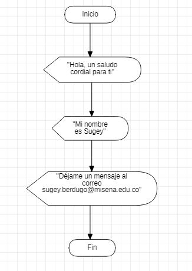

# Clase Programación 
## Septiembre 02 del 2021


El instructor habló acerca de variables y de qué manera se pueden utilizar
dependiendo el lenguaje de programación. En este caso se mostraron ejercicios
que fueron realizados en excel con visual basic, y en dart. 

Se mencionó que no es válido iniciar una variable con un número. Además, no pueden 
tener "ñ", tildes, caracteres especiales, ni guión medio. A excepción del lenguaje de programación Javascript, que sí permite su utilización. Es totalmente válido utilizar números después de letras y también guión bajo.


## Ejercicio ejemplo 1


```
Sub ejemplo()
    MsgBox "Hola mundo"
End Sub
```


## Ejercicio ejemplo 2

    
    void main(){

        print('Hola mundo');
    }        


## Práctica

_A continuación se muestra actividad que consiste en realizar un programa que muestra tres mensajes al usuario en visual basic, y su respectivo diagrama de flujo_


**Diagrama de flujo**




**Programa en visual basic**

  ```
  Sub programa()
    MsgBox "Hola, un saludo cordial para ti"
    MsgBox "Mi nombre es Sugey"
    MsgBox "Déjame un mensaje al correo sugey.berdugo@misena.edu.co"
  End Sub
  ```


## Flipgrid

[Haz clic aquí para ir al video](https://flipgrid.com/e3eaa9b1)
   