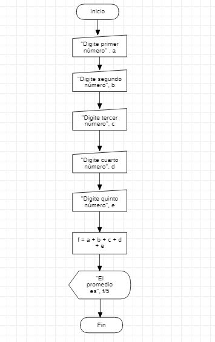

# Clase de programación

## Septiembre 09 del 2021

El día 09 de Septiembre, se estuvieron tratando varios puntos relacionados a programación estructurada. 

Primeramente, seguimos trabajando con visual basic. Aprendimos de qué manera podemos crear un programa que realice cálculos básicos de suma. Además de esto, vimos de qué manera realizar su diagrama de flujo.  "Manual input" es algo nuevo a utilizar. 

En visual basic se utiliza "InputBox" si queremos pedir al usuario que digite información; en este caso, el usuario escribiría números que serán usados para ser sumados y dar finalmente un resultado, que se muestre con "Msgbox". 


### Ejercicio ejemplo Visual Basic

```
Sub ejemplo()
    a = InputBox("Digite primer numero")
    b = InputBox("Digite segundo numero")
    c = a + b
    MsgBox "La suma es " & c
End Sub
```

### Práctica

_Hacer un programa en excel que calcule el promedio de 5 números y los muestre por pantalla_

#### Programa:

```
Sub promedio()
    a = InputBox("Digite primer número")
    b = InputBox("Digite segundo número")
    c = InputBox("Digite tercer número")
    d = InputBox("Digite cuarto número")
    e = InputBox("Digite quinto número")
    f = Int(a) + Int(b) + Int(c) + Int(d) + Int(e)
    MsgBox "El promedio es " & f / 5
End Sub
```

#### Diagrama de flujo




