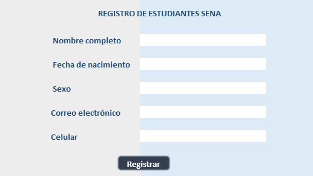

# Clase de programación

## Septiembre 20 del 2021

El tema de esta clase, estuvo enfocado a la creación de funciones y de formularios en excel. Además de cómo almacenar la información de este formulario, en otra hoja de cálculo.

A continuación se muestran ejemplos dados en clase, y la actividad que se asignó como práctica:


### Ejemplo "Hola mundo"

```
Sub prueba1()
    sena.Cells(2,4) = "Hola mundo"
End Sub
```

### Ejemplo Formulario

```
Sub prueba()
    Datos.Cells(3,1) = form.Cells(6,4)
    Datos.Cells(3,4) = form.Cells(8,4)
    MsgBox "Registro almacenado"
    form.Cells(6,4) = ""
    form.Cells(8,4) = ""
```


### Ejemplo Función

```
Function promediosena(a,b,c)
    promedio = (a + b + c) / 3
    promediosena = promedio
End Function
```

### Ejercicio práctico

_Crear un formulario y crear función llamada =misnotas debe mostrar la palabra ganó o perdio. Ganando con promedio igual o mayor a 7._




```
Sub info()
    data.Cells(2, 2) = form.Cells(3, 5)
    data.Cells(2, 4) = form.Cells(5, 5)
    data.Cells(2, 6) = form.Cells(7, 5)
    data.Cells(2, 7) = form.Cells(9, 5)
    data.Cells(2, 9) = form.Cells(11, 5)
    MsgBox "El registro se ha completado correctamente"
    form.Cells(3, 5) = ""
    form.Cells(5, 5) = ""
    form.Cells(7, 5) = ""
    form.Cells(9, 5) = ""
    form.Cells(11, 5) = ""
End Sub
```

```
Function misnotas(s, u, g, b, c)
    calcula = (s + u + g + b + c) / 5
    If (calcula < 7) Then
        MsgBox "Reprobó con " & calcula & " como nota final"
    Else
        MsgBox "Aprobó con " & calcula & " como nota final"
    End If
End Function
```